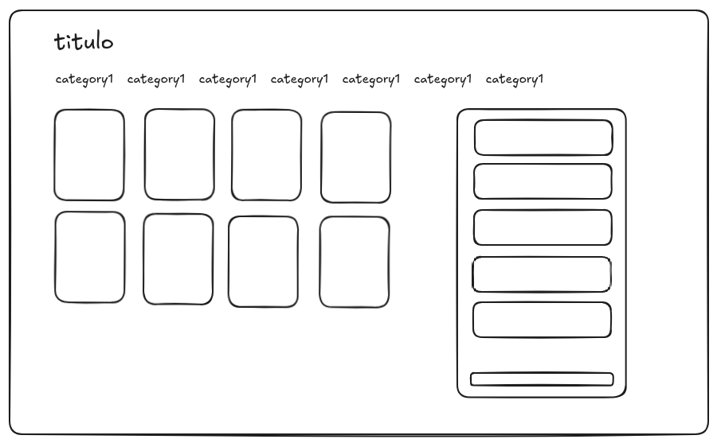

## Teste Técnico

Esse repositório faz parte de uma feature para um teste técnico.
A feature consiste na criação de uma ordem a partir de itens selecionados.
Para a crição tomamos apenas como referencia o valor total de todos os produtos selecionados.

Segue abaixo uma simplificação das entidades do que viria a ser um backend e um wireframe da interface do frontend:




## Etapas do desenvolvimento


## Como uppar o projeto?
Para uppar o projeto é necessário fazer o clone de dois repositórios em um diretório como base,
exemplo `/path/back-test` e `/path/front-test`:

```sh
git clone https://github.com/lucsduartee/back-test.git
git clone https://github.com/lucsduartee/front-test.git
```

Depois disso entre em cada um dos diretórios em terminais diferentes, rodando em ambos os terminais os seguintes comandos:

```sh
npm install
npm run dev
```

O terminal que se refere ao backend vai retornar algo do tipo:

```
[ info ] starting HTTP server...
╭──────────────────────────────────────────────────╮
│                                                  │
│    Server address: http://localhost:46415        │
│    Watch Mode: HMR                               │
│    Ready in: 317 ms                              │
│                                                  │
╰──────────────────────────────────────────────────╯
[13:46:38.365] INFO (17076): started HTTP server on localhost:46415

```

onde 46415 se refere a porta em que a aplicação backend está rodando.
Feito isso, vá até o diretório `/front-test/pages/index.vue` do projeto frontend
altere a porta na linha 55 para o valor da porta em que a aplicação backend está rodando:

```js
async function createOrder() {
  //... 
  try {
    const order = await $fetch("http://localhost:46415/api/orders", {
      method: "POST",
      body: {
        value: cartTotalValue.value,
      },
    });

  // ...

```

Feito isso, abra o navegador no endereço `http://localhost:3000`, e a simples aplicação frontend estará rodando e você poderá simular a crição de uma ordem.

Você pode conferir o sucesso da criação da ordem usando um api client de sua preferência, e bater na rota `http://localhost:46415/api/orders`, (mesma lógica de portas do backend) usando o método GET.